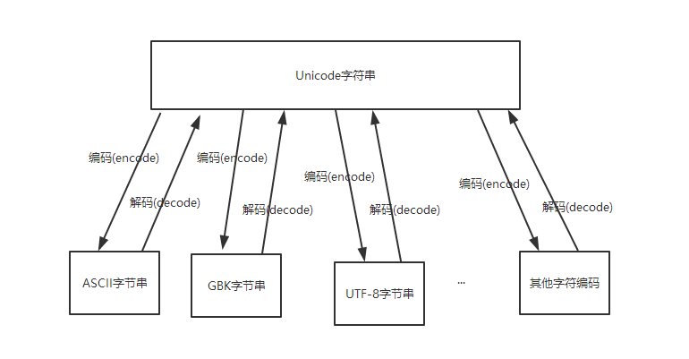

# 字符编码

## 字符编码的作用

计算机只认识0和1组成的二进制序列，因此任何文件中的内容要想被计算机识别或者想存储在计算机上都需要转换为二进制序列。那么字符与二进制序列怎么进行想换转换呢？于是人们尝试建立一个表格来**存储一个字符与一个二进制序列的对应关系**。

- **编码**：将字符转换为对应的二进制序列的过程叫做字符编码
- **解码**：将二进制序列转换为对应的字符的过程叫做字符解码


## 字符编码的简单发展过程

### ASCII码诞生

最早建立这个字符与十进制数字对应的关系的是美国，这张表被称为ASCII码(American Standard Code for Information Interface，美国标准信息交换代码)。ASCII码是基于拉丁字母的一套电脑编程系统，主要用于显示现代英语和其他西欧语言。它被设计为用1个字节来表示一个字符，所以ASCII码表最多只能表示`2 * 8 = 256`个字符。实际上ASCII码表中只有128个字符，剩余的128个字符是预留扩展用的。


### Latin-1

虽然ASCII好用，但是，很多时候一个字符用一个字节并不够。例如，各种符号和重音字符并不在ASCII所定义的可能字符的范围中， 为了容纳特殊字符，一些标准允许一个8位字节的所有bit都用来表示字符，那么，一个字节最多就可以表示255个字符了，这样的一个标准叫latin-1 

Latin1是ISO-8859-1的别名，有些环境下写作Latin-1。ISO-8859-1编码是单字节编码，向下兼容ASCII，其编码范围是0x00-0xFF，0x00-0x7F之间完全和ASCII一致，0x80-0x9F之间是控制字符，0xA0-0xFF之间是文字符号。 

因为Latin-1 编码范围使用了单字节内的所有空间，在支持Latin-1 的系统中传输和存储其他任何编码的字节流都不会被抛弃。换句话说就是把其他任何编码的字节流当作Latin-1编码看待都没有问题。这是个很重要的特性，MySQL数据库默认编码是Latin1就是利用了这个特性。 

在latin-1中，127以上的字符代码分配给了重音和其他特殊字符。

#### latin-1与ASCII的区别

1. 在计算机里面一个字节是8位二进制，8位二进制可以表示255个字符，但是ASCII只有128个，也就是说第八位的那个bit是没有用的，只用到了后面的7个bit来表示ASCII，但是latin-1就把第八位的那个bit用到了，换句话说就是把一个字节的最高位的bit也使用上了。
2. latin-1虽然对ASCII进行了扩展，可以表示最多为256个字符，但是，它仅适合美国英语，甚至一些英语中常用的标点符号、重音符号都不能表示，无法表示各国语言，特别是中文等表意文字（一种用象征性书写符号记录词或词素的文字体系，不直接或不单纯表示语音。 ）

### GBK等各国编码诞生

随着计算机的普及和发展，很过国家都开始使用计算机。大家发现ASCII码预留的128个位置根本无法存储自己国家的文字和字符，因此各个国家开始制定各自的字符编码表，其中中国的的字符编码表有GB 2312和GBK。

#### GB 2312

GB 2312是一个简体中文汉字编码国家标准，GB2312对汉字采用双字节编码，由6763个常用汉字和682个全角的非汉字字符组成。其中汉字根据使用的频率分为两级。一级汉字3755个，二级汉字3008个。由于字符数量比较大，GB2312采用了二维矩阵编码法对所有字符进行编码。

#### BIG5编码

台湾地区繁体中文标准字符集，采用双字节编码，也称为大五码，具体的信息我就不介绍了，百度上一堆

#### GBK编码

1995年12月发布的汉字编码国家标准，是对GB2312编码的扩充，对汉字采用双字节编码。GBK字符集共收录21003个汉字，包含国家标准GB13000-1中的全部中日韩汉字，和BIG5编码中的所有汉字。

**最一开始，在Unicode 出现之前，各地区国家制定了不同的编码系统，也就是说中文自己进行编码，如GB 2312 和大五码等，日文也自己进行编码，如主要用JIS ，这样会造成混乱不便，例如一个文本信息里面混合了不同的语言，就不能正确的表示信息，也就是无法进行混合的使用。**

### Unicode诞生

后来随着世界互联网的形成和发展，各国的人们开始有了互相交流的需要。但是这个时候就存在一个问题，每个国家所使用的字符编码表都是不同的。比如我们发送一句“你好，我好喜欢你演的爱情动作电影!”给岛国的仓老师，苍老师电脑上用的是日本的字符编码表，因此她的电脑无法正确显示我们发送的内容。这个时候，人们希望有一个世界统一的字符编码表来存放所有国家所使用的文字和符号，这就是Unicode。Unicode又被称为 统一码、万国码、单一码，它是为了解决传统的字符编码方案的局限性而产生的，它为每种语言中的每个字符设定了统一并且为之一的二进制编码。Unicode规定所有的字符和符号最少由2个字节（16位）来表示，所以Unicode码可以表示的最少字符个数为`2 * 16=65536`。

### UTF-8诞生

为什么已经有了Unicode还要UTF-8呢？这是由于当时存储设备是非常昂贵的，而Unicode中规定所有字符最少要由2个字节表示。人们认为像原来ASCII码中的字符用1个字节就可以了，因此人们决定创建一个新的字符编码来节省存储空间。UTF-8是对Unicode编码的压缩和优化，它不在要求最少使用2个字节，而是将所有字符和符号进行分类：

- ascii码中的内容用1个字节保存
- 欧洲的字符用2个字节保存
- 东亚的字符用3个字节保存
- ...

UTF-8是目前最常用，也是被推荐使用的字符编码。

|  字符  |  ASCII   |      Unicode      | UTF-8                      |
| :--: | :------: | :---------------: | -------------------------- |
|  A   | 01000001 | 00000000 01000001 | 01000001                   |
|  中   |    x     | 01001110 00101101 | 11100100 10111000 10101101 |

从上面的表格还可以发现，UTF-8编码有一个额外的好处，就是ASCII编码实际上可以被看成是UTF-8编码的一部分，所以，大量只支持ASCII编码的历史遗留软件可以在UTF-8编码下继续工作。

## 计算机系统字符编码工作方式

在计算机内存中，统一使用Unicode编码，当需要保存到硬盘或者需要传输的时候，就转换为UTF-8编码。

用记事本编辑的时候，从文件读取的UTF-8字符被转换为Unicode字符到内存里，编辑完成后，保存的时候再把Unicode转换为UTF-8保存到文件：


浏览网页的时候，服务器会把动态生成的Unicode内容转换为UTF-8再传输到浏览器：


所以你看到很多网页的源码上会有类似`<meta charset="UTF-8" />`的信息，表示该网页正是用的UTF-8编码。


## 字符与字节

一个字符不等价于一个字节，字符是人类能够识别的符号，而这些符号要保存到计算的存储中就需要用计算机能够识别的字节来表示。一个字符往往有多种表示方法，不同的表示方法会使用不同的字节数。这里所说的不同的表示方法就是指字符编码，比如字母A-Z都可以用ASCII码表示（占用一个字节），也可以用Unicode表示（占两个字节），还可以用UTF-8表示（占用一个字节）。字符编码的作用就是将人类可识别的字符转换为机器可识别的字节码，以及反向过程。

**UNICDOE才是真正的字符串，而用ASCII、UTF-8、GBK等字符编码表示的是字节串**。关于这点，我们可以在Python的官方文档中经常可以看到这样的描述"Unicode string" , " translating a Unicode string into a sequence of bytes"

我们写代码是写在文件中的，而字符是以字节形式保存在文件中的，因此当我们在文件中定义个字符串时被当做字节串也是可以理解的。但是，我们需要的是字符串，而不是字节串。一个优秀的编程语言，应该严格区分两者的关系并提供巧妙的完美的支持。JAVA语言就很好，以至于了解Python和PHP之前我从来没有考虑过这些不应该由程序员来处理的问题。遗憾的是，很多编程语言试图混淆“字符串”和“字节串”，他们把字节串当做字符串来使用，PHP和Python2都属于这种编程语言。最能说明这个问题的操作就是取一个包含中文字符的字符串的长度：

- 对字符串取长度，结果应该是所有字符串的个数，无论中文还是英文
- 对字符串对应的字节串取长度，就跟编码(encode)过程使用的字符编码有关了(比如：UTF-8编码，一个中文字符需要用3个字节来表示；GBK编码，一个中文字符需要2个字节来表示)

注意：Windows的cmd终端字符编码默认为GBK，因此在cmd输入的中文字符需要用两个字节表示

```python
>>> # Python2
>>> a = 'Hello,中国'        # 字节串，长度为字节个数
>>> type(a)                # <type 'str'>
>>> len(a)                 # 12 = len('Hello,') + len('中国') = 6 + 3 * 2
>>> b = u'Hello,中国'       # 字符串，长度为字符个数 
>>> type(b)                # <type 'Unicode'>
>>> len(b)                 # 8 = len('Hello,') + len('中国') = 6 + 2
>>> c = Unicode(a, 'utf8')  
>>> type(c)                # <type 'Unicode'>
>>> len(c)                 # 8
```


## 编码与解码

Unicode字符编码，也是一张字符与数字的映射，但是这里的数字被称为代码点(code point)，实际上就是十六进制的数字。

Python官方文档中对Unicode字符串、字节串与编码之间的关系有这样一段描述：

> Unicode字符串是一个代码点（code point）序列，代码点取值范围为0到0x10FFFF（对应的十进制为1114111）。这个代码点序列在存储（包括内存和物理磁盘）中需要被表示为一组字节(0到255之间的值)，而将Unicode字符串转换为字节序列的规则称为编码。

这里说的编码不是指字符编码，而是指编码的过程以及这个过程中所使用到的**Unicode字符的代码点与字节的映射规则**。这个映射不必是简单的一对一映射，因此编码过程也不必处理每个可能的Unicode字符，例如：

将Unicode字符串转换为ASCII编码的规则很简单--对于每个代码点：

- 如果代码点数值<128，则每个字节与代码点的值相同
- 如果代码点数值>=128，则Unicode字符串无法在此编码中进行表示（这种情况下，Python会引发一个UnicodeEncodeError异常）

将Unicode字符串转换为UTF-8编码使用以下规则：

- 如果代码点数值<128，则由相应的字节值表示（与Unicode转ASCII字节一样）
- 如果代码点数值>=128，则将其转换为一个2个字节，3个字节或4个字节的序列，该序列中的每个字节都在128到255之间。

简单总结：

- **编码(encode)**：将Unicode字符串（中的代码点)转换特定字符编码对应的字节串的过程和规则
- **解码(decode)**：将特定字符编码的字节串转换为对应的Unicode字符串(中的代码点)的过程和规则

可见，无论是编码还是解码，都需要一个重要因素，就是**特定的字符编码**。因为一个字符用不同的字符编码进行编码后的字节值以及字节个数大部分情况下是不同的，反之亦然。


## 字符编码转换

Unicode字符串可以与任意字符编码的字节进行相互转换，如图：



那么大家很容易想到一个问题，就是不同的字符编码的字节可以通过Unicode相互转换吗？答案是肯定的。

最后需要说明的是，Unicode不是有道词典，也不是google翻译器，它并不能把一个中文翻译成一个英文。正确的字符编码的转换过程只是把同一个字符的字节表现形式改变了，而字符本身的符号是不应该发生变化的，因此并不是所有的字符编码之间的转换都是有意义的。怎么理解这句话呢？比如GBK编码的“中国”转成UTF-8字符编码后，仅仅是由4个字节变成了6个字节来表示，但其字符表现形式还应该是“中国”，而不应该变成“你好”或者“China”。


