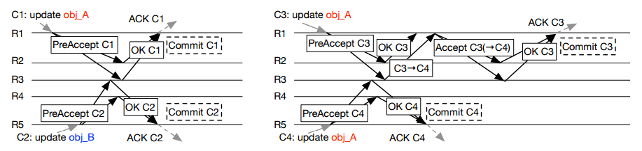

## 分布式系统定义

狭义的分布式系统指由网络连接的计算机系统，每个节点独立地承担计算或存储任务，节点间通过网络协同工作。广义的分布式系统是一个相对的概念，正如[Leslie Lamport](https://en.wikipedia.org/wiki/Leslie_Lamport)所说：

> What is a distributed systeme. **Distribution is in the eye of the beholder.**
> To the user sitting at the keyboard, his IBM personal computer is a nondistributed system. 
> To a flea crawling around on the circuit board, or to the engineer who designed it, it's very much a distributed system.

分布式系统会划分成多个子系统或模块，各自运行在不同的机器上，子系统或模块之间通过网络通信进行协作，实现最终的整体功能。比如分布式操作系统、分布式程序设计语言及其编译(解释)系统、分布式文件系统和分布式数据库系统等。利用多个节点共同协作完成一项或多项具体业务功能的系统就是分布式系统。

## 分布式系统特点

- **分布性**：分布式系统中的多台计算机都会在空间中随意分布，同时，机器的分布情况也会随时变动。
- **对等性**：分布式系统中的计算机没有主/从之分，既没有控制整个系统的主机，也没有被控制的从机，组成分布式系统的所有计算机节点都是对等的，副本指的是分布式系统对数据和服务提供的一种冗余方式，为了对外提供高可用的服务，我们往往会对数据和服务进行副本处理。数据副本是指在不同的节点上持久化同一份数据，当某一个节点上存储的数据丢失时，可以从副本上读取到该数据，这是解决分布式系统数据丢失问题最为有效的手段。服务副本是只多个节点提供同样的服务，每个节点都有能力接受来自外部的请求并进行相应的处理。
- **并发性**：同一分布式系统中的多个节点，可能会并发地操作一些共享资源，诸如数据库或分布式存储等，如何高效地协调分布式并发操作也成为了分布式系统架构与设计中最大的挑战之一。
- **缺乏全局时钟**：典型的分布式系统由一系列在空间上随意分布的多个进程组成，具有明显的分布性，这些进程之间通过交换消息来进行互相通信，因此，在分布式系统中，很难定义两个时间究竟谁先谁后，原因就是因为分布式系统缺乏一个全局的时钟序列控制。
- **故障总是会发生**：组成分布式系统的所有计算机，都有可能发生任何形式的故障，任何在设计阶段考虑到的异常情况，一定会在系统实际运行中发生。

## 分布式环境问题

- **通信异常**：从集中式到分布式，必然引入了网络因素，而由于网络本身的不可靠性，因此就引入了额外的问题。分布式系统各节点之间的网络通信能够正常进行，其延时也会远大于单机操作，在消息的收发过程中，消息丢失和消息延迟变得十分普遍。
- **网络分区**：当网络发生异常情况时，导致分布式系统中部分节点之间的网络延时不断增大，最终导致组成分布式系统的所有节点中，只有部分节点之间能够正常通信，而另一些节点则不能，这种现象称之为网络分区，当网络分区出现时，分布式系统会出现局部小集群，在极端情况下，这些局部小集群会独立完成原本需要整个分布式系统才能完成的功能，包括对数据的事务处理，这就对分布式一致性提出了非常大的挑战。
- **三态**：由于网络可能会出现各种各样的问题，因此分布式系统的每一次请求与响应，存在特有的三态概念：成功、失败、超时。当网络在异常情况下，可能会出现超时现象，通常由以下两种情况：1. 由于网络原因，该请求并没有被成功地发送到接收方，而是在发送过程就发生了消息丢失现象。2. 该请求成功的被接收方接受后，并进行了处理，但是在将响应反馈给发送方时，发生了消息丢失现象。
- **节点故障**：节点故障是指组成分布式系统的服务器节点出现宕机或僵死现象，每个节点都有可能出现故障，并且每天都在发生。

## 事务ACID特性

事务是由一系列对系统中数据进行访问与更新的操作所组成的一个程序执行单元，狭义上的食物特指数据库事务。一方面，当多个应用程序并发访问数据库时，事务可以在这些应用程序之间提供一个隔离方法，以防止彼此的操作相互干扰，另一方面，事务为数据库操作序列提供了一个从失败中恢复到正常状态的方法，同时提供了数据库即使在宜昌状态下仍能保持数据一致性的方法。事务具有原子性（Atomicity）、一致性（Consistency）、隔离性（Isolation）、持久性（Durability），简称ACID。

- ① **原子性**：指事务必须是一个原子的操作序列单元，事务中包含的各项操作在一次执行过程中，只允许出现以下两种状态之一，全部成功执行，全部不执行。任何一项操作失败都将导致整个事务失败，同时其他已经被执行的操作都将被撤销并回滚，只有所有操作全部成功，整个事务才算是成功完成。
- ② **一致性**：指事务的执行不能破坏数据库数据的完整性和一致性，一个事务在执行之前和执行之后，数据库都必须处于一致性状态，即事务执行的结果必须是使数据库从一个一致性状态转变到另一个一致性状态，因此当数据库只包含成功事务提交的结果时，就能说数据库处于一致性状态，而如果数据库系统在运行过程中发生故障，有些事务尚未完成就被迫中断，这些未完成的事务对数据库所做的修改有一部分已写入物理数据库，这时数据库就处于一种不正确的状态，或者说是不一致的状态。
- ③ **隔离性**：指在并发环境中，并发的事务是相互隔离的，一个事务的执行不能被其他事务干扰，即不同的事务并发操作相同的数据时，每个事务都有各自完整的数据空间，即一个事务内部的操作及使用的数据对其他并发事务是隔离的，并发执行的各个事务之间不能相互干扰。
- ④ **持久性**：指一个事务一旦提交，他对数据库中对应数据的状态变更就应该是永久的，即一旦某个事务成功结束，那么它对数据库所做的更新就必须被永久的保存下来，即使发生系统崩溃或者宕机故障，只要数据库能够重新启动，那么一定能够将其恢复到事务成功结束时的状态。

**分布式事务**：是指事务的参与者、支持事务的服务器、资源服务器以及事务管理器分别位于分布式系统的不同节点上，通常一个分布式事务中会涉及对多个数据源或业务系统的操作。一个分布式事务可以看做是由多个分布式的操作序列组成，通常可以把这一系列分布式的操作序列称为子事务。由于在分布式事务中，各个子事务的执行是分布式的，因此要实现一种能够保证ACID特性的分布式事务处理系统就显得格外复杂。

## CAP理论

CAP理论，是由 Eric Brewer 提出的分布式系统中最为重要的理论之一。CAP 三个字母分别代表了分布式系统中三个相互矛盾的属性。CAP分别代表强一致性（Consistency）、可用性（Availiablity）、网络分区容忍性（Tolerance to the partition of network）。

- **数据强一致性（Consistency）**：强一致性，即每个节点上的数据时刻保持一致。如果系统对一个写操作返回成功，那么之后的读请求都必须读到这个新数据；如果返回失败，那么所有读操作都不能读到这个数据，对调用者而言数据具有强一致性(strong consistency) (又叫原子性 atomic、线性一致性 linearizable consistency)。

  一致性，指数据在多个副本之间是否能够保持一致的特性，在一致性的需求下，当一个系统在数据一致的状态下执行更新操作后，应该保证系统的数据仍然处于一致状态。对于一个将数据副本分布在不同分布式节点上的系统来来说，如果对第一个结点的数据进行了更新操作并且成功后，却没有使得第二个节点上的数据得到相应的更新，于是在对第二个结点的数据进行读取操作时，获取的仍然是老数据（脏数据），这就是典型的分布式数据不一致的情况，在分布式系统中，如果能够做到针对一个数据项的更新操作执行成功后，所有的用户都可以读取到期最新的值，那么这样的系统就被认为具有强一致性。

- **服务可用性（Availiablity）**：分布式系统在出现异常情况的时候的可用度。所有读写请求在一定时间内得到响应，可终止、不会一直等待。

  可用性，指系统提供的服务必须一直处于可用的状态，对于用户的每一操作请求总是能够在有限的时间内返回结果。

- **网络分区容错性（Partition-tolerance）**：在网络分区的情况下，被分隔的节点仍能正常对外服务。

  分区容错性，分布式系统在遇到任何网络分区故障时，仍然需要能够保证对外提供满足一致性和可用性的服务，除非是整个网络环境都发生了故障。

CAP理论指出：**无法设计一种分布式协议，使得同时完全具备CAP三个属性，即该种协议下的副本始终是强一致性&服务始终是可用的&协议可以容忍任何网络分区异常**；==分布式系统协议只能在CAP这三者间所有折中==。

在某时刻如果满足AP，分隔的节点同时对外服务但不能相互通信，将导致状态不一致，即不能满足C；如果满足CP，网络分区的情况下为达成C，请求只能一直等待，即不满足A；如果要满足CA，在一定时间内要达到节点状态一致，要求不能出现网络分区，则不能满足P。

C、A、P三者最多只能满足其中两个，和FLP定理一样，CAP定理也指示了一个不可达的结果(impossibility result)。

CAP折中的实现可以体现在分布式协议中：

- **Lease机制**牺牲了部分异常情况下的A，从而获得了完全的C与很好的P。
- **Quorum机制**，即总共有N个副本，成功更新W个副本则算成功提交，读取时读R个副本。这种一般的 Quorum机制，在CAP三大因素中都各做了折中，有一定的C，有较好的A，也有较好的P，是一种较为平衡的分布式协议。
- **两阶段提交**系统具有完全的C，很不好A，很不好P。
- **Paxos协议**具有完全的C，较好的A，较好的P。

### CAP的工程启示

CAP理论提出7、8年后，NoSql圈将CAP理论当作对抗传统关系型数据库的依据、阐明自己放宽对数据一致性(consistency)要求的正确性，随后引起了大范围关于CAP理论的讨论。

 CAP理论看似给我们出了一道3选2的选择题，但在工程实践中存在很多现实限制条件，需要我们做更多地考量与权衡，避免进入CAP认识误区。

#### 关于 P 的理解

Partition字面意思是网络分区，即因网络因素将系统分隔为多个单独的部分，有人可能会说，网络分区的情况发生概率非常小啊，是不是不用考虑P，保证CA就好。要理解P，我们看回CAP证明中P的定义：

In order to model partition tolerance, the network will be allowed to lose arbitrarily many messages sent from one node to another. 

网络分区的情况符合该定义，网络丢包的情况也符合以上定义，另外节点宕机，其他节点发往宕机节点的包也将丢失，这种情况同样符合定义。现实情况下我们面对的是一个不可靠的网络、有一定概率宕机的设备，这两个因素都会导致Partition，因而分布式系统实现中 P 是一个必须项，而不是可选项。

对于分布式系统工程实践，CAP理论更合适的描述是：在满足分区容错的前提下，没有算法能同时满足数据一致性和服务可用性：

In a network subject to communication failures, it is impossible for any web service to implement an atomic read/write shared memory that guarantees a response to every request.

#### CA非0/1的选择

P 是必选项，那3选2的选择题不就变成数据一致性(consistency)、服务可用性(availability) 2选1？工程实践中一致性有不同程度，可用性也有不同等级，在保证分区容错性的前提下，放宽约束后可以兼顾一致性和可用性，两者不是非此即彼。

CAP定理证明中的一致性指强一致性，强一致性要求多节点组成的被调要能像单节点一样运作、操作具备原子性，数据在时间、时序上都有要求。如果放宽这些要求，还有其他一致性类型：

- 序列一致性(sequential consistency)：不要求时序一致，A操作先于B操作，在B操作后如果所有调用端读操作得到A操作的结果，满足序列一致性
- 最终一致性(eventual consistency)：放宽对时间的要求，在被调完成操作响应后的某个时间点，被调多个节点的数据最终达成一致

可用性在CAP定理里指所有读写操作必须要能终止，实际应用中从主调、被调两个不同的视角，可用性具有不同的含义。当P(网络分区)出现时，主调可以只支持读操作，通过牺牲部分可用性达成数据一致。

工程实践中，较常见的做法是通过异步拷贝副本(asynchronous replication)、quorum/NRW，实现在调用端看来数据强一致、被调端最终一致，在调用端看来服务可用、被调端允许部分节点不可用(或被网络分隔)的效果。

####  跳出CAP

CAP理论对实现分布式系统具有指导意义，但CAP理论并没有涵盖分布式工程实践中的所有重要因素。

例如延时(latency)，它是衡量系统可用性、与用户体验直接相关的一项重要指标。CAP理论中的可用性要求操作能终止、不无休止地进行，除此之外，我们还关心到底需要多长时间能结束操作，这就是延时，它值得我们设计、实现分布式系统时单列出来考虑。

延时与数据一致性也是一对“冤家”，如果要达到强一致性、多个副本数据一致，必然增加延时。加上延时的考量，我们得到一个CAP理论的修改版本PACELC：如果出现P(网络分区)，如何在A(服务可用性)、C(数据一致性)之间选择；否则，如何在L(延时)、C(数据一致性)之间选择。

**CAP理论对分布式系统实现有非常重大的影响，我们可以根据自身的业务特点，在数据一致性和服务可用性之间作出倾向性地选择。通过放松约束条件，我们可以实现在不同时间点满足CAP(此CAP非CAP定理中的CAP，如C替换为最终一致性)**。

## BASE

BASE是基本可用（Basically Available）、Soft state（弱状态）、Eventually consistent（最终一致性）三个短语的简写。

- ① 基本可用，指分布式系统在出现不可预知故障时，允许损失部分可用性，如响应时间上的损失或功能上的损失。
- ② 弱状态，也称为软状态，指允许系统中的二数据存在中间状态，并认为该中间状态的存在不会影响系统的整体可用性，即允许系统在不同节点的数据副本之间进行数据同步的过程存在延时。
- ③ 最终一致性，指系统中所有的数据副本，在经过一段时回见的同步后，最终能够达到一个一致的状态，因此最终一致性的本质是需要系统保证数据能够达到一致，而不需要实时保证系统数据的强一致性。

## 一致性(consensus**)**

一致性是分布式理论中的根本性问题，近半个世纪以来，科学家们围绕着一致性问题提出了很多理论模型，依据这些理论模型，业界也出现了很多工程实践投影。

在分布式系统中，每一个机器节点虽然能够明确知道自己在进行事务操作过程中的结果是成功或是失败，但是却无法直接获取到其他分布式节点的操作结果，因此，当一个事务操作需要跨越多个分布式节点的时候，为了保持事务处理的ACID的特性，需要引入协调者的组件来统一调度所有分布式节点的执行逻辑，而被调度的节点则被称为参与者，协调者负责调度参与者的行为并最终决定这些参与者是否要把事务真正进行提交，基于这个思想，衍生出了二阶段提交（2PC）和三阶段提交（3PC）两种协议。

何为一致性问题？简单而言，一致性问题就是相互独立的节点之间如何达成一项决议的问题。分布式系统中，进行数据库事务提交(commit transaction)、Leader选举、序列号生成等都会遇到一致性问题。

假设一个具有N个节点的分布式系统，当其满足以下条件时，我们说这个系统满足一致性：

1. **全认同(agreement)**：所有N个节点都认同一个结果
2. **值合法(validity)**：该结果必须由N个节点中的节点提出
3. **可结束(termination)**：决议过程在一定时间内结束，不会无休止地进行下去

看似简单的事情，分布式系统实现起来并不轻松，因为它面临着这些问题：

- **消息传递异步无序(asynchronous)**：现实网络不是一个可靠的信道，存在消息延时、丢失，节点间消息传递做不到同步有序(synchronous)
- **节点宕机(fail-stop)**：节点持续宕机，不会恢复
- **节点宕机恢复(fail-recover)**：节点宕机一段时间后恢复，在分布式系统中最常见
- **网络分化(network partition)**：网络链路出现问题，将N个节点隔离成多个部分
- **拜占庭将军问题(byzantine failure)**：节点或宕机或逻辑失败，甚至不按套路出牌抛出干扰决议的信息

一致性还具备两个属性，一个是强一致(safety)，它要求所有节点状态一致、共进退；一个是可用(liveness)，它要求分布式系统24*7无间断对外服务。FLP定理(FLP impossibility) 已经证明在一个收窄的模型中(异步环境并只存在节点宕机)，不能同时满足 safety 和 liveness。

FLP定理是分布式系统理论中的基础理论，正如物理学中的能量守恒定律彻底否定了永动机的存在，FLP定理否定了同时满足safety 和 liveness 的一致性协议的存在。

工程实践上根据具体的业务场景，或保证强一致(safety)，或在节点宕机、网络分化的时候保证可用(liveness)。2PC、3PC是相对简单的解决一致性问题的协议，下面我们就来了解2PC和3PC。

## 选举(electioin)

选举(election)是分布式系统实践中常见的问题，通过打破节点间的对等关系，选得的leader(或叫master、coordinator)有助于实现事务原子性、提升决议效率。 多数派(quorum)的思路帮助我们在网络分化的情况下达成决议一致性，在leader选举的场景下帮助我们选出唯一leader。租约(lease)在一定期限内给予节点特定权利，也可以用于实现leader选举。

一致性问题(consistency)是独立的节点间如何达成决议的问题，选出大家都认可的leader本质上也是一致性问题，因而如何应对宕机恢复、网络分化等在leader选举中也需要考量。

Bully算法是最常见的选举算法，其要求每个节点对应一个序号，序号最高的节点为leader。leader宕机后次高序号的节点被重选为leader，过程如下：

- (a). 节点4发现leader不可达，向序号比自己高的节点发起重新选举，重新选举消息中带上自己的序号
- (b)(c). 节点5、6接收到重选信息后进行序号比较，发现自身的序号更大，向节点4返回OK消息并各自向更高序号节点发起重新选举
- (d). 节点5收到节点6的OK消息，而节点6经过超时时间后收不到更高序号节点的OK消息，则认为自己是leader
- (e). 节点6把自己成为leader的信息广播到所有节点

在一致性算法[Paxos](http://www.cnblogs.com/bangerlee/p/5655754.html)、ZAB、Raft中，为提升决议效率均有节点充当leader的角色。ZAB、Raft中描述了具体的leader选举实现，与Bully算法类似ZAB中使用zxid标识节点，具有最大zxid的节点表示其所具备的事务(transaction)最新、被选为leader。

### 多数派(quorum)

在网络分化的场景下以上Bully算法会遇到一个问题，被分隔的节点都认为自己具有最大的序号、将产生多个leader，这时候就需要引入多数派(quorum)。多数派的思路在分布式系统中很常见，其确保网络分化情况下决议唯一。

 多数派的原理说起来很简单，假如节点总数为2f+1，则一项决议得到多于 f 节点赞成则获得通过。leader选举中，网络分化场景下只有具备多数派节点的部分才可能选出leader，这避免了多leader的产生。

 多数派的思路还被应用于副本(replica)管理，根据业务实际读写比例调整写副本数Vw、读副本数Vr，用以在可靠性和性能方面取得平衡。

### 租约(lease)

选举中很重要的一个问题，以上尚未提到：怎么判断leader不可用、什么时候应该发起重新选举？最先可能想到会通过心跳(heart beat)判别leader状态是否正常，但在网络拥塞或瞬断的情况下，这容易导致出现双主。

租约(lease)是解决该问题的常用方法，其最初提出时用于解决分布式缓存一致性问题，后面在分布式锁等很多方面都有应用。

 

租约的原理同样不复杂，中心思想是每次租约时长内只有一个节点获得租约、到期后必须重新颁发租约。假设我们有租约颁发节点Z，节点0、1和2竞选leader，租约过程如下：

- (a). 节点0、1、2在Z上注册自己，Z根据一定的规则(例如先到先得)颁发租约给节点，该租约同时对应一个有效时长；这里假设节点0获得租约、成为leader
- (b). leader宕机时，只有租约到期(timeout)后才重新发起选举，这里节点1获得租约、成为leader 

租约机制确保了一个时刻最多只有一个leader，避免只使用心跳机制产生双主的问题。在实践应用中，zookeeper、ectd可用于租约颁发。

在分布式系统理论和实践中，常见leader、quorum和lease的身影。分布式系统内不一定事事协商、事事民主，leader的存在有助于提升决议效率。

最后提一个有趣的问题与大家思考，leader选举的本质是一致性问题，Paxos、Raft和ZAB等解决一致性问题的协议和算法本身又需要或依赖于leader，怎么理解这个看似“蛋生鸡、鸡生蛋”的问题？

## 时序

现实生活中时间是很重要的概念，时间可以记录事情发生的时刻、比较事情发生的先后顺序。分布式系统的一些场景也需要记录和比较不同节点间事件发生的顺序，但不同于日常生活使用物理时钟记录时间，分布式系统使用逻辑时钟记录事件顺序关系，下面我们来看分布式系统中几种常见的逻辑时钟。

### 物理时钟 vs 逻辑时钟

可能有人会问，为什么分布式系统不使用物理时钟(physical clock)记录事件？每个事件对应打上一个时间戳，当需要比较顺序的时候比较相应时间戳就好了。

这是因为现实生活中物理时间有统一的标准，而分布式系统中每个节点记录的时间并不一样，即使设置了 [NTP](http://www.zhihu.com/question/24960940) 时间同步节点间也存在毫秒级别的偏差。因而分布式系统需要有另外的方法记录事件顺序关系，这就是逻辑时钟(logical clock)。

### Lamport timestamps

[Leslie](https://en.wikipedia.org/wiki/Leslie_Cheung) [Lamport](https://en.wikipedia.org/wiki/Leslie_Lamport) 在1978年提出逻辑时钟的概念，并描述了一种逻辑时钟的表示方法，这个方法被称为Lamport时间戳(Lamport timestamps)。

分布式系统中按是否存在节点交互可分为三类事件，一类发生于节点内部，二是发送事件，三是接收事件。Lamport时间戳原理如下：

1. 每个事件对应一个Lamport时间戳，初始值为0
2. 如果事件在节点内发生，时间戳加1
3. 如果事件属于发送事件，时间戳加1并在消息中带上该时间戳
4. 如果事件属于接收事件，时间戳 = Max(本地时间戳，消息中的时间戳) + 1

 假设有事件a、b，C(a)、C(b)分别表示事件a、b对应的Lamport时间戳，如果C(a) < C(b)，则有a发生在b之前(happened before)，记作 a -> b，例如上图中有 C1 -> B1。通过该定义，事件集中Lamport时间戳不等的事件可进行比较，我们获得事件的[偏序关系](https://en.wikipedia.org/wiki/Partially_ordered_set#Formal_definition)(partial order)。

 如果C(a) = C(b)，那a、b事件的顺序又是怎样的？假设a、b分别在节点P、Q上发生，Pi、Qj分别表示我们给P、Q的编号，如果 C(a) = C(b) 并且 Pi < Qj，同样定义为a发生在b之前，记作 a => b。假如我们对图1的A、B、C分别编号Ai = 1、Bj = 2、Ck = 3，因 C(B4) = C(C3) 并且 Bj < Ck，则 B4 => C3。 

通过以上定义，我们可以对所有事件排序、获得事件的[全序关系](https://en.wikipedia.org/wiki/Total_order)(total order)。上图例子，我们可以从C1到A4进行排序。

### **Vector clock**

Lamport时间戳帮助我们得到事件顺序关系，但还有一种顺序关系不能用Lamport时间戳很好地表示出来，那就是同时发生关系(concurrent)。例如上图中事件B4和事件C3没有因果关系，属于同时发生事件，但Lamport时间戳定义两者有先后顺序。 

Vector clock是在Lamport时间戳基础上演进的另一种逻辑时钟方法，它通过vector结构不但记录本节点的Lamport时间戳，同时也记录了其他节点的Lamport时间戳。Vector clock的原理与Lamport时间戳类似，使用图例如下：

 

假设有事件a、b分别在节点P、Q上发生，Vector clock分别为Ta、Tb，如果 Tb[Q] > Ta[Q] 并且 Tb[P] >= Ta[P]，则a发生于b之前，记作 a -> b。到目前为止还和Lamport时间戳差别不大，那Vector clock怎么判别同时发生关系呢？

 如果 Tb[Q] > Ta[Q] 并且 Tb[P] < Ta[P]，则认为a、b同时发生，记作 a <-> b。例如上图中节点B上的第4个事件 (A:2，B:4，C:1) 与节点C上的第2个事件 (B:3，C:2) 没有因果关系、属于同时发生事件。

### Version vector

基于Vector clock我们可以获得任意两个事件的顺序关系，结果或为先后顺序或为同时发生，识别事件顺序在工程实践中有很重要的引申应用，最常见的应用是发现数据冲突(detect conflict)。

分布式系统中数据一般存在多个副本(replication)，多个副本可能被同时更新，这会引起副本间数据不一致，Version vector的实现与Vector clock非常类似，目的用于发现数据冲突。下面通过一个例子说明Version vector的用法：

 

- client端写入数据，该请求被Sx处理并创建相应的vector ([Sx, 1])，记为数据D1
- 第2次请求也被Sx处理，数据修改为D2，vector修改为([Sx, 2])
- 第3、第4次请求分别被Sy、Sz处理，client端先读取到D2，然后D3、D4被写入Sy、Sz
- 第5次更新时client端读取到D2、D3和D4 3个数据版本，通过类似Vector clock判断同时发生关系的方法可判断D3、D4存在数据冲突，最终通过一定方法解决数据冲突并写入D5

Vector clock只用于发现数据冲突，不能解决数据冲突。如何解决数据冲突因场景而异，具体方法有以最后更新为准(last write win)，或将冲突的数据交给client由client端决定如何处理，或通过quorum决议事先避免数据冲突的情况发生。

由于记录了所有数据在所有节点上的逻辑时钟信息，Vector clock和Version vector在实际应用中可能面临的一个问题是vector过大，用于数据管理的元数据(meta data)甚至大于数据本身。

解决该问题的方法是使用server id取代client id创建vector (因为server的数量相对client稳定)，或设定最大的size、如果超过该size值则淘汰最旧的vector信息。

**通过Lamport timestamps可以建立事件的全序关系，通过Vector clock可以比较任意两个事件的顺序关系并且能表示无因果关系的事件，将Vector clock的方法用于发现数据版本冲突，于是有了Version vector**。

## 2PC

2PC(tow phase commit)两阶段提交，顾名思义它分成两个阶段，先由一方进行提议并收集其他节点的反馈，再根据反馈决定提交或中止事务。我们将提议的节点称为协调者，其他参与决议节点称为参与者。

- 2PC(tow phase commit)
- 协调者(coordinator)
- 协调者看门狗(coordinator watchdog)
- 参与者(participants，或cohorts)
- 提议(propose)
- 反馈(vote)
- 提交(commit)
- 准备提交(prepare to commit)
- 中止(abort)
- 异步环境(asynchronous)
- 节点宕机(fail-stop)
- 节点宕机-恢复(fail-recover)
- 阻塞(block)
- 问询(query) 
- 记录(logging)
- 时延(latency)
- RTT(propose+commit)
- 回滚(rollback)
- 确认(ACK)

在异步环境并且没有节点宕机的模型下，2PC可以满足全认同、值合法、可结束，是解决一致性问题的一种协议。但如果再加上节点宕机-恢复的考虑，2PC是否还能解决一致性问题呢？

协调者如果在发起提议后宕机，那么参与者将进入阻塞状态、一直等待协调者回应以完成该次决议。这时需要另一角色把系统从不可结束的状态中带出来，我们把新增的这一角色叫协调者看门狗。协调者宕机一定时间后，看门狗接替原协调者工作，通过问询各参与者的状态，决定阶段2是提交还是中止。这也要求协调者/参与者记录历史状态，以备协调者宕机后看门狗对参与者查询、协调者宕机恢复后重新找回状态。 

从协调者接收到一次事务请求、发起提议到事务完成，经过2PC协议后增加了2次RTT(propose+commit)，带来的时延增加相对较少。

#### 阶段一：提交事务请求

- ① **事务询问**，协调者向所有的参与者发送事务内容，询问是否可以执行事务提交操作，并开始等待各参与者的响应。
- ② **执行事务**，各参与者节点执行事务操作（已经执行），并将Undo和Redo信息记入事务日志中。
- ③ **各参与者向协调者反馈事务询问的响应**，如果参与者成功执行了事务操作，那么就反馈给协调者Yes响应，表示事务可以执行；如果参与者没有成功执行事务，那么就反馈给协调者No响应，表示事务不可以执行。

第一阶段近似于是协调者组织各参与者对一次事务操作的投票表态的过程，因此二阶段提交协议的阶段一也被称为投票阶段。

#### 阶段二：执行事务提交

协调者会根据各参与者的反馈情况来决定最终是否可以进行事务提交操作，正常情况包含如下两种可能：

1. **执行事务提交**，假如协调者从所有的参与者获得的反馈都是Yes响应，那么就会执行事务提交。

- ① **发送提交请求**，协调者向所有参与者节点发出Commit请求。 
- ② **事务提交**，参与者接收到Commit请求后，会正式执行事务提交操作，并在完成提交之后释放在整个事务执行期间占用的事务资源。
- ③ **反馈事务提交结果**，参与者在完成事务提交之后，向协调者发送Ack消息。
- ④ **完成事务**，协调者接收到所有参与者反馈的Ack消息后，完成事务。

2. **中断事务**，假如任意一个参与者向协调者反馈了No响应，或者在等待超时之后，协调者尚无法接收到参与者的反馈响应，就会中断事务。

- ① **发送回滚请求**，协调者向所有参与者节点发出Rollback请求。
- ② **事务回滚**，参与者接收到Rollback请求后，会利用其在阶段一中记录的Undo信息来执行事务回滚，并在完成回滚之后释放在整个事务执行期间占用的资源。
- ③ **反馈事务回滚结果**，参与者在完成事务回滚后，向协调者发送Ack消息。
- ④ **中断事务**，协调者接收所有参与者反馈的Ack消息后，完成事务中断。

二阶段提交协议的优点：原理简单，实现方便。缺点：同步阻塞，单点问题，数据不一致，太过保守。

- **同步阻塞**：在二阶段提交的执行过程中，所有参与该事务操作的逻辑都处于阻塞状态，即当参与者占有公共资源时，其他节点访问公共资源不得不处于阻塞状态。

- **单点问题**：若协调器出现问题，那么整个二阶段提交流程将无法运转，若协调者是在阶段二中出现问题时，那么其他参与者将会一直处于锁定事务资源的状态中，而无法继续完成事务操作。

- **数据不一致**：在二阶段的阶段二，执行事务提交的时候，当协调者向所有的参与者发送Commit请求之后，发生了局部网络异常或者是协调者在尚未发送完Commit请求之前自身发生了崩溃，导致最终只有部分参与者收到了Commit请求，于是会出现数据不一致的现象。

- **太过保守**：在进行事务提交询问的过程中，参与者出现故障而导致协调者始终无法获取到所有参与者的响应信息的话，此时协调者只能依靠自身的超时机制来判断是否需要中断事务，这样的策略过于保守，即没有完善的容错机制，任意一个结点的失败都会导致整个事务的失败。

## 3PC

3PC(three phase commit)即三阶段提交，既然2PC可以在异步网络+节点宕机恢复的模型下实现一致性，那还需要3PC做什么，3PC是什么鬼？

在2PC中一个参与者的状态只有它自己和协调者知晓，假如协调者提议后自身宕机，在看门狗启用前一个参与者又宕机，其他参与者就会进入既不能回滚、又不能强制commit的阻塞状态，直到参与者宕机恢复。这引出两个疑问：

1. 能不能去掉阻塞，使系统可以在commit/abort前回滚到决议发起前的初始状态
2. 当次决议中，参与者间能不能相互知道对方的状态，又或者参与者间根本不依赖对方的状态

相比2PC，3PC增加了一个准备提交(prepare to commit)阶段来解决以上问题。

协调者接收完参与者的反馈之后，进入阶段2，给各个参与者发送准备提交指令。参与者接到准备提交指令后可以锁资源，但要求相关操作必须可回滚。协调者接收完确认后进入阶段3、进行commit/abort，3PC的阶段3与2PC的阶段2无异。协调者看门狗、状态记录同样应用在3PC。

参与者如果在不同阶段宕机，我们来看看3PC如何应对：

- **阶段1**: 协调者或看门狗未收到宕机参与者的反馈，直接中止事务；宕机的参与者恢复后，读取记录发现未发出赞成反馈，自行中止该次事务
- **阶段2**: 协调者未收到宕机参与者的precommit ACK，但因为之前已经收到了宕机参与者的赞成反馈(不然也不会进入到阶段2)，协调者进行commit；看门狗可以通过问询其他参与者获得这些信息，过程同理；宕机的参与者恢复后发现收到precommit或已经发出赞成反馈，则自行commit该次事务
- **阶段3**: 即便协调者或看门狗未收到宕机参与者的commit ACK，也结束该次事务；宕机的参与者恢复后发现收到commit或者precommit，也将自行commit该次事务

因为有了准备提交(prepare to commit)阶段，3PC的事务处理延时也增加了1个RTT，变为3个RTT(propose+precommit+commit)，但是它防止参与者宕机后整个系统进入阻塞态，增强了系统的可用性，对一些现实业务场景是非常值得的。

三阶段提交，**将二阶段提交协议的提交事务请求过程分为CanCommit、PreCommit、doCommit三个阶段组成的事务处理协议**。

#### 阶段一：canCommit

- ① **事务询问**，协调者向所有的参与者发送一个包含事务内容的canCommit请求，询问是否可以执行事务提交操作，并开始等待各参与者的响应。
- ② **各参与者向协调者反馈事务询问的响应**，参与者在接收到来自协调者的canCommit请求后，正常情况下，如果自身认为可以顺利执行事务，则反馈Yes响应，并进入预备状态，否则反馈No响应。

#### 阶段二：preCommit

该阶段会根据反馈情况决定是否可以进行事务preCommit操作，正常情况下，包含如下两种可能：

**执行事务预提交**，假如所有参与反馈的都是Yes，那么就会执行事务预提交。

- ① **发送预提交请求**，协调者向所有参与者节点发出preCommit请求，并进入prepared阶段。
- ② **事务预提交**，参与者接收到preCommit请求后，会执行事务操作，并将Undo和Redo信息记录到事务日志中。
- ③ **各参与者向协调者反馈事务执行的响应**，若参与者成功执行了事务操作，那么反馈Ack，同时等待最终的指令：提交（commit）或终止（abort）。

**中断事务**，若任一参与反馈了No响应，或者在等待超时后，协调者尚无法接收到所有参与者反馈，则中断事务。

- ① **发送中断请求**，协调者向所有参与者发出abort请求。
- ② **中断事务**，无论是收到来自协调者的abort请求或者等待协调者请求过程中超时，参与者都会中断事务。

#### 阶段三：doCommit

该阶段会进行真正的事务提交，也会存在如下情况。　　

1. 执行提交

- ① **发送提交请求**，进入这一阶段，若协调者处于正常工作状态，并且他接收到了来自所有参与者的Ack响应，那么他将从预提交状态转化为提交状态，并向所有的参与者发送doCommit请求。
- ② **事务提交**，参与者接收到doCommit请求后，会正式执行事务提交操作，并在完成提交之后释放整个事务执行过程中占用的事务资源。
- ③ **反馈事务提交结果**，参与者在完成事务提交后，向协调者发送Ack响应。
- ④ **完成事务**，协调者接收到所有参与者反馈的Ack消息后，完成事务。

2. 中断事务

- ① **发送中断请求**，协调者向所有的参与者节点发送abort请求。
- ② **事务回滚**，参与者收到abort请求后，会根据记录的Undo信息来执行事务回滚，并在完成回滚之后释放整个事务执行期间占用的资源。
- ③ **反馈事务回滚结果**，参与者在完成事务回滚后，向协调者发送Ack消息。
- ④ **中断事务**，协调者接收到所有参与者反馈的Ack消息后，中断事务。

三阶段提交协议降低了参与者的阻塞范围，能够在发生单点故障后继续达成一致。但是其可能还是会发生数据不一致问题。

## Paxos算法原理与推导

Paxos算法在分布式领域具有非常重要的地位。但是Paxos算法有两个比较明显的缺点：1.难以理解 2.工程实现更难。

==**Paxos算法是基于消息传递且具有高度容错特性的一致性算法，是目前公认的解决分布式一致性问题最有效的算法之一**==。

Google Chubby的作者Mike Burrows说过这个世界上只有一种一致性算法，那就是Paxos，其它的算法都是残次品。

虽然Mike Burrows说得有点夸张，但是至少说明了Paxos算法的地位。然而，Paxos算法也因为晦涩难懂而臭名昭著。本文的目的就是带领大家深入浅出理解Paxos算法，不仅理解它的执行流程，还要理解算法的推导过程，作者是怎么一步步想到最终的方案的。只有理解了推导过程，才能深刻掌握该算法的精髓。而且理解推导过程对于我们的思维也是非常有帮助的，可能会给我们带来一些解决问题的思路，对我们有所启发。

### 问题产生的背景

在常见的分布式系统中，总会发生诸如机器宕机或网络异常（包括消息的延迟、丢失、重复、乱序，还有网络分区）等情况。Paxos算法需要解决的问题就是如何在一个可能发生上述异常的分布式系统中，快速且正确地在集群内部对某个数据的值达成一致，并且保证不论发生以上任何异常，都不会破坏整个系统的一致性。

注：这里某个数据的值并不只是狭义上的某个数，它可以是一条日志，也可以是一条命令（command）。。。根据应用场景不同，某个数据的值有不同的含义。

### 相关概念

在Paxos算法中，有三种角色：

- Proposer
- Acceptor
- Learners

在具体的实现中，一个进程可能同时充当多种角色。比如一个进程可能既是Proposer又是Acceptor又是Learner。

还有一个很重要的概念叫提案（Proposal）。最终要达成一致的value就在提案里。

注：

- 暂且认为『提案=value』，即提案只包含value。在我们接下来的推导过程中会发现如果提案只包含value，会有问题，于是我们再对提案重新设计。
- 暂且认为『Proposer可以直接提出提案』。在我们接下来的推导过程中会发现如果Proposer直接提出提案会有问题，需要增加一个学习提案的过程。

Proposer可以提出（propose）提案；Acceptor可以接受（accept）提案；如果某个提案被选定（chosen），那么该提案里的value就被选定了。

回到刚刚说的『对某个数据的值达成一致』，指的是Proposer、Acceptor、Learner都认为同一个value被选定（chosen）。那么，Proposer、Acceptor、Learner分别在什么情况下才能认为某个value被选定呢？

- Proposer：只要Proposer发的提案被Acceptor接受（刚开始先认为只需要一个Acceptor接受即可，在推导过程中会发现需要半数以上的Acceptor同意才行），Proposer就认为该提案里的value被选定了。
- Acceptor：只要Acceptor接受了某个提案，Acceptor就认为该提案里的value被选定了。
- Learner：Acceptor告诉Learner哪个value被选定，Learner就认为那个value被选定。

### 问题描述

假设有一组可以提出（propose）value（value在提案Proposal里）的进程集合。一个一致性算法需要保证提出的这么多value中，只有一个value被选定（chosen）。如果没有value被提出，就不应该有value被选定。如果一个value被选定，那么所有进程都应该能学习（learn）到这个被选定的value。对于一致性算法，安全性（safaty）要求如下：

- 只有被提出的value才能被选定。
- 只有一个value被选定，并且
- 如果某个进程认为某个value被选定了，那么这个value必须是真的被选定的那个。

我们不去精确地定义其活性（liveness）要求。我们的目标是保证最终有一个提出的value被选定。当一个value被选定后，进程最终也能学习到这个value。

Paxos的目标：==保证最终有一个value会被选定，当value被选定后，进程最终也能获取到被选定的value==。

假设不同角色之间可以通过发送消息来进行通信，那么：

- 每个角色以任意的速度执行，可能因出错而停止，也可能会重启。一个value被选定后，所有的角色可能失败然后重启，除非那些失败后重启的角色能记录某些信息，否则等他们重启后无法确定被选定的值。
- 消息在传递过程中可能出现任意时长的延迟，可能会重复，也可能丢失。但是消息不会被损坏，即消息内容不会被篡改（拜占庭将军问题）。

### 推导过程

#### 只有一个Acceptor

假设只有一个Acceptor（可以有多个Proposer），只要Acceptor接受它收到的第一个提案，则该提案被选定，该提案里的value就是被选定的value。这样就保证只有一个value会被选定。

但是，如果这个唯一的Acceptor宕机了，那么整个系统就无法工作了！

因此，必须要有多个Acceptor！

#### 多个Acceptor

多个Acceptor的情况如下图。那么，如何保证在多个Proposer和多个Acceptor的情况下选定一个value呢？

下面开始寻找解决方案。

如果我们希望即使只有一个Proposer提出了一个value，该value也最终被选定。

那么，就得到下面的约束：

==P1：一个Acceptor必须接受它收到的第一个提案。==

但是，这又会引出另一个问题：如果每个Proposer分别提出不同的value，发给不同的Acceptor。根据P1，Acceptor分别接受自己收到的value，就导致不同的value被选定。出现了不一致。如下图：

刚刚是因为『一个提案只要被一个Acceptor接受，则该提案的value就被选定了』才导致了出现上面不一致的问题。因此，我们需要加一个规定：

规定：==一个提案被选定需要被半数以上的Acceptor接受==

这个规定又暗示了：『一个Acceptor必须能够接受不止一个提案！』不然可能导致最终没有value被选定。比如上图的情况。v1、v2、v3都没有被选定，因为它们都只被一个Acceptor的接受。

最开始讲的『提案=value』已经不能满足需求了，于是重新设计提案，给每个提案加上一个提案编号，表示提案被提出的顺序。令『提案=提案编号+value』。

虽然允许多个提案被选定，但必须保证所有被选定的提案都具有相同的value值。否则又会出现不一致。

于是有了下面的约束：

==P2：如果某个value为v的提案被选定了，那么每个编号更高的被选定提案的value必须也是v。==

一个提案只有被Acceptor接受才可能被选定，因此我们可以把P2约束改写成对Acceptor接受的提案的约束P2a。

==P2a：如果某个value为v的提案被选定了，那么每个编号更高的被Acceptor接受的提案的value必须也是v。==

只要满足了P2a，就能满足P2。

但是，考虑如下的情况：假设总的有5个Acceptor。Proposer2提出[M1,V1]的提案，Acceptor2~5（半数以上）均接受了该提案，于是对于Acceptor2~5和Proposer2来讲，它们都认为V1被选定。Acceptor1刚刚从宕机状态恢复过来（之前Acceptor1没有收到过任何提案），此时Proposer1向Acceptor1发送了[M2,V2]的提案（V2≠V1且M2>M1），对于Acceptor1来讲，这是它收到的第一个提案。根据P1（一个Acceptor必须接受它收到的第一个提案。）,Acceptor1必须接受该提案！同时Acceptor1认为V2被选定。这就出现了两个问题：

1. Acceptor1认为V2被选定，Acceptor2~5和Proposer2认为V1被选定。出现了不一致。
2. V1被选定了，但是编号更高的被Acceptor1接受的提案[M2,V2]的value为V2，且V2≠V1。这就跟P2a（如果某个value为v的提案被选定了，那么每个编号更高的被Acceptor接受的提案的value必须也是v）矛盾了。

所以我们要对P2a约束进行强化！

P2a是对Acceptor接受的提案约束，但其实提案是Proposer提出来的，所有我们可以对Proposer提出的提案进行约束。得到P2b：

==P2b：如果某个value为v的提案被选定了，那么之后任何Proposer提出的编号更高的提案的value必须也是v。==

由P2b可以推出P2a进而推出P2。

那么，如何确保在某个value为v的提案被选定后，Proposer提出的编号更高的提案的value都是v呢？

只要满足P2c即可：

==P2c：对于任意的N和V，如果提案[N, V]被提出，那么存在一个半数以上的Acceptor组成的集合S，满足以下两个条件中的任意一个：==

- ==S中每个Acceptor都没有接受过编号小于N的提案。==
- ==S中Acceptor接受过的最大编号的提案的value为V。==

#### Proposer生成提案

为了满足P2b，这里有个比较重要的思想：Proposer生成提案之前，应该先去『学习』已经被选定或者可能被选定的value，然后以该value作为自己提出的提案的value。如果没有value被选定，Proposer才可以自己决定value的值。这样才能达成一致。这个学习的阶段是通过一个『Prepare请求』实现的。

于是我们得到了如下的提案生成算法：

- Proposer选择一个新的提案编号N，然后向某个Acceptor集合（半数以上）发送请求，要求该集合中的每个Acceptor做出如下响应（response）。
  - (a) 向Proposer承诺保证不再接受任何编号小于N的提案。
  - (b) 如果Acceptor已经接受过提案，那么就向Proposer响应已经接受过的编号小于N的最大编号的提案。

  我们将该请求称为编号为N的Prepare请求。

- 如果Proposer收到了半数以上的Acceptor的响应，那么它就可以生成编号为N，Value为V的提案[N,V]。这里的V是所有的响应中编号最大的提案的Value。如果所有的响应中都没有提案，那 么此时V就可以由Proposer自己选择。

  生成提案后，Proposer将该提案发送给半数以上的Acceptor集合，并期望这些Acceptor能接受该提案。我们称该请求为Accept请求。（注意：此时接受Accept请求的Acceptor集合不一定是之前响应Prepare请求的Acceptor集合）

#### Acceptor接受提案

Acceptor可以忽略任何请求（包括Prepare请求和Accept请求）而不用担心破坏算法的安全性。因此，我们这里要讨论的是什么时候Acceptor可以响应一个请求。

我们对Acceptor接受提案给出如下约束：

==P1a：一个Acceptor只要尚未响应过任何编号大于N的Prepare请求，那么他就可以接受这个编号为N的提案。==

如果Acceptor收到一个编号为N的Prepare请求，在此之前它已经响应过编号大于N的Prepare请求。根据P1a，该Acceptor不可能接受编号为N的提案。因此，该Acceptor可以忽略编号为N的Prepare请求。当然，也可以回复一个error，让Proposer尽早知道自己的提案不会被接受。

因此，一个Acceptor只需记住：1. 已接受的编号最大的提案 2. 已响应的请求的最大编号。

#### Paxos算法描述

经过上面的推导，我们总结下Paxos算法的流程。

Paxos算法分为两个阶段。具体如下：

- 阶段一：
  - (a) Proposer选择一个提案编号N，然后向半数以上的Acceptor发送编号为N的Prepare请求。
  - (b) 如果一个Acceptor收到一个编号为N的Prepare请求，且N大于该Acceptor已经响应过的所有Prepare请求的编号，那么它就会将它已经接受过的编号最大的提案（如果有的话）作为响应反馈给Proposer，同时该Acceptor承诺不再接受任何编号小于N的提案。
- 阶段二：
  - (a) 如果Proposer收到半数以上Acceptor对其发出的编号为N的Prepare请求的响应，那么它就会发送一个针对[N,V]提案的Accept请求给半数以上的Acceptor。注意：V就是收到的响应中编号最大的提案的value，如果响应中不包含任何提案，那么V就由Proposer自己决定。
  - (b) 如果Acceptor收到一个针对编号为N的提案的Accept请求，只要该Acceptor没有对编号大于N的Prepare请求做出过响应，它就接受该提案。

### Learner学习被选定的value

Learner学习（获取）被选定的value有如下三种方案：

### 如何保证Paxos算法的活性

通过选取主Proposer，就可以保证Paxos算法的活性。至此，我们得到一个既能保证安全性，又能保证活性的分布式一致性算法——Paxos算法。

### 参考资料

- 论文《Paxos Made Simple》
- 论文《The Part-Time Parliament》
- 英文版维基百科的Paxos
- 中文版维基百科的Paxos
- 书籍《从Paxos到ZooKeeper》

## Basic Paxos

Paxos算法是一种基于消息传递且具有高度容错特性的一致性算法，其需要解决的问题就是如何在一个可能发生异常的分布式系统中，快速且正确地在集群内部对某个数据的值达成一致，并且保证不论发生以上任何异常，都不会破坏整个系统的一致性。

和2PC类似，Paxos先把节点分成两类，发起提议(proposal)的一方为proposer，参与决议的一方为acceptor。

在没有失败和消息丢失的情况下，假如只有一个提议被提出的情况，如何确定一个提议，做到如下就可以保证

**==P1：一个acceptor必须接受它收到的第一个提议。==**

P1会引入一个问题，如果多个提议被不同的proposer同时提出，这可能会导致虽然每个acceptor都批准了它收到的第一个提议，但是没有一个提议是由多数acceptor都接受的，因此无法确定一个提议。

即使只有两个提议被提出，如果每个提议都被差不多一半的acceptor批准了，此时也可能无法确定哪个提议。

在P1的基础上，增加如下条件：

- a. proposer发起的每项提议分别用一个ID标识，提议的组成因此变为(ID, value)
- b. 若确定一个提议，需要由半数以上的acceptor接受，当某个提议被半数以上的acceptor接受后，我们就认为该提议就被确定了。

我们约定后面发起的提议的ID比前面提议的ID大，并假设可以有多项提议被确定，为做到确定并只确定一个值acceptor要做到以下这点：

**==P2：如果一项值为v的提议被确定，那么后续只确定值为v的提议。==**

由于一项提议被确定(chosen)前必须先被多数派acceptor接受(accepted)，为实现P2，实质上acceptor需要做到：

**==P2a：如果一项值为v的提议被确定，那么acceptor后续只接受值为v的提议。==**

在acceptor1没有收到任何提议的情况下，其他4个acceptor已经批准了来自proposer2的提议[M0,V1]，而此时，proposer1产生了一个具有其他value值的，编号更高的提议[M1,V2]，并发送给了acceptor1，根据P1，就需要接受该提议，但是这与P2a矛盾，因此如果要同时满足P1和P2a，需要进入如下强化

**==P2b：如果一项值为v的提议被确定，那么proposer后续只发起值为v的提议。==**

P2b约束的是提议被确定(chosen)后proposer的行为，我们更关心提议被确定前proposer应该怎么做。

**==P2c：对于提议(n,v)，acceptor的多数派S中，如果存在acceptor最近一次(即ID值最大)接受的提议的值为v'，那么要求v = v'；否则v可为任意值。==**

满足P2c则P2b成立 (P2c => P2b => P2a => P2)。

条件P2c是Basic Paxos的核心，光看P2c的描述可能会觉得一头雾水，我们通过 [The Part-Time Parliament](http://research.microsoft.com/en-us/um/people/lamport/pubs/lamport-paxos.pdf) 中的例子加深理解：

| 提议ID | 提议值  | AcceptorA | AcceptorB | AcceptorC | AcceptorD | AcceptorE |
| ---- | ---- | --------- | --------- | --------- | --------- | --------- |
| 2    | a    | x         | x         | x         | o         | -         |
| 5    | b    | x         | x         | o         | -         | x         |
| 14   | ?    | -         | o         | -         | x         | o         |
| 27   | ?    | o         | -         | o         | o         | -         |
| 29   | ?    | -         | o         | x         | x         | -         |

假设有A~E 5个acceptor，- 表示acceptor因宕机等原因缺席当次决议，x 表示acceptor不接受提议，o 表示接受提议；多数派acceptor接受提议后提议被确定，以上表格对应的决议过程如下：

1. ID为2的提议最早提出，根据P2c其提议值可为任意值，这里假设为a
2. acceptor A/B/C/E 在之前的决议中没有接受(accept)任何提议，因而ID为5的提议的值也可以为任意值，这里假设为b
3. acceptor B/D/E，其中D曾接受ID为2的提议，根据P2c，该轮ID为14的提议的值必须与ID为2的提议的值相同，为a
4. acceptor A/C/D，其中D曾接受ID为2的提议、C曾接受ID为5的提议，相比之下ID 5较ID 2大，根据P2c，该轮ID为27的提议的值必须与ID为5的提议的值相同，为b；该轮决议被多数派acceptor接受，因此该轮决议得以确定
5. acceptor B/C/D，3个acceptor之前都接受过提议，相比之下C、D曾接受的ID 27的ID号最大，该轮ID为29的提议的值必须与ID为27的提议的值相同，为b

 以上提到的各项约束条件可以归纳为3点，如果proposer/acceptor满足下面3点，那么在少数节点宕机、网络分化隔离的情况下，在“确定并只确定一个值”这件事情上可以保证一致性(consistency)：

- B1(ß): ß中每一轮决议都有唯一的ID标识
- B2(ß): 如果决议B被acceptor多数派接受，则确定决议B
- B3(ß): 对于ß中的任意提议B(n,v)，acceptor的多数派中如果存在acceptor最近一次(即ID值最大)接受的提议的值为v'，那么要求v = v'；否则v可为任意值

*(注: 希腊字母ß表示多轮决议的集合，字母B表示一轮决议)*

另外为保证P2c，我们对acceptor作两个要求：

1. 记录曾接受的ID最大的提议，因proposer需要问询该信息以决定提议值
2. 在回应提议ID为n的proposer自己曾接受过ID最大的提议时，acceptor同时保证(promise)不再接受ID小于n的提议

 至此，proposer/acceptor完成一轮决议可归纳为prepare和accept两个阶段。prepare阶段proposer发起提议问询提议值、acceptor回应问询并进行promise；accept阶段完成决议，图示如下：

还有一个问题需要考量，假如proposer A发起ID为n的提议，在提议未完成前proposer B又发起ID为n+1的提议，在n+1提议未完成前proposer C又发起ID为n+2的提议…… 如此acceptor不能完成决议、形成活锁(livelock)，虽然这不影响一致性，但我们一般不想让这样的情况发生。解决的方法是从proposer中选出一个leader，提议统一由leader发起。

最后我们再引入一个新的角色：learner，learner依附于acceptor，用于习得已确定的决议。以上决议过程都只要求acceptor多数派参与，而我们希望尽量所有acceptor的状态一致。如果部分acceptor因宕机等原因未知晓已确定决议，宕机恢复后可经本机learner采用pull的方式从其他acceptor习得。

### proposer生成提议

在proposer产生一个编号为Mn的提议时，必须要知道当前某一个将要或已经被半数以上acceptor接受的编号小于Mn但为最大编号的提议，并且，proposer会要求所有的acceptor都不要再接受任何编号小于Mn的提议，这也就是如下提议生成算法。

1. proposer选择一个新的提议编号为Mn，然后向某个acceptor集合的成员发送请求，要求该集合中的acceptor做出如下回应。

- ① 向proposer承诺，保证不再接受任何编号小于Mn的提议。
- ② 如果acceptor已经接受过任何提议，那么其就向proposer反馈当前该acceptor已经接受的编号小于Mn但为最大编号的那个提议的值。

我们将请求称为编号Mn的提议的Prepare请求。

2. 如果proposer收到了来自半数以上的acceptor的响应结果，那么它就可以产生编号为Mn、Value值为Vn的提议，这里的Vn是所有响应中编号最大的提议Value的值，当然，如果半数以上的acceptor都没有接受过任何提议，即响应中不包含任何提议，那么此时Vn值就可以由proposer任意选择。

在确定了proposer的提议后，proposer就会将该提议再次发送给某个acceptor集合，并期望获得它们的接受，此请求称为accept请求，此时接受accept请求的acceptor集合不一定是之前响应prepare请求的acceptor集合。

### acceptor接受提议

一个acceptor可能会收到来自proposer的两种请求，分别是prepare请求和accept请求，对这两类请求作出响应的条件分别如下

prepare请求：acceptor可以在任何时候响应一个prepare请求。

accept请求：在不违背accept现有承诺的前提下，可以任意响应accept请求。

因此，对acceptor逻辑处理的约束条件，大体可以定义如下：

P1a：一个acceptor只要尚未响应过任何编号大于Mn的prepare请求，那么它就可以接受这个编号为Mn的提议。

### 算法描述

阶段一：

　　① proposer选择一个提议编号Mn，然后向acceptor的某个超过半数的子集成员发送编号为Mn的prepare请求。

　　② 如果一个acceptor收到编号为Mn的prepare请求，且编号Mn大于该acceptor已经响应的所有prepare请求的编号，那么它就会将它已经接受过的最大编号的提议作为响应反馈给proposer，同时该acceptor承诺不会再接受任何编号小于Mn的提议。

阶段二：

　　① 如果proposer收到来自半数以上的acceptor对于其发出的编号为Mn的prepare请求响应，那么它就会发送一个针对[Mn,Vn]提议的accept请求给acceptor，注意，Vn的值就是收到的响应中编号最大的提议的值，如果响应中不包含任何提议，那么它就是任意值。

　　② 如果acceptor收到这个针对[Mn,Vn]提议的accept请求，只要该accept尚未对编号大于Mn的prepare请求作出响应，它就可以接受这个提议。

### 提议的获取

使learner获取提议，有如下方案

　　① 一旦acceptor接受了一个提议，就将该提议发送给所有的learner，通信开销很大。

　　② 让所有的acceptor将它们对提议的接受情况，统一发送给一个特定的learner（主learner），当该learner被通知一个提议已经被确定时，它就负责通知其他的learner。主learner可能会出现单点故障。

　　③ 将主learner范围扩大至一个特定的learner集合，该集合中的每个learner都可以在一个提议被选定后通知所有其他的learner，集合learner越多，越可靠，但是通信开销越大。

### 选取主proposer保证算法的活性

假设存在如下的极端情况，有两个proposer依次提出了一系列编号递增的提议，但是最终都无法被确定，具体流程如下：

proposer1提出了编号为M1的提议，然后完成了上述的第一阶段，与此同时，proposer2提出了编号为M2的提议，同样完成了第一阶段，于是acceptor承诺不再接受编号小于M2的提议，因此，当proposer1进入阶段二时，其发出的accept请求会被acceptor忽略，于是proposer1又进入第一阶段并提出了编号为M3的提议，这导致proposer2的accept请求被忽略，一次类推，提议的确定过程将陷入死循环。

为了保证Paxos算法的活性，就必须选择一个主proposer，并规定只有主proposer才能提出提议。

## Multi Paxos

通过以上步骤分布式系统已经能确定一个值，“只确定一个值有什么用？这可解决不了我面临的问题。” 你心中可能有这样的疑问。

其实不断地进行“确定一个值”的过程、再为每个过程编上序号，就能得到具有全序关系(total order)的系列值，进而能应用在数据库副本存储等很多场景。我们把单次“确定一个值”的过程称为实例(instance)，它由proposer/acceptor/learner组成，下图说明了A/B/C三机上的实例：

不同序号的实例之间互相不影响，A/B/C三机输入相同、过程实质等同于执行相同序列的状态机(state machine)指令 ，因而将得到一致的结果。 

proposer leader在Multi Paxos中还有助于提升性能，常态下统一由leader发起提议，可节省prepare步骤(leader不用问询acceptor曾接受过的ID最大的提议、只有leader提议也不需要acceptor进行promise)直至发生leader宕机、重新选主。

Multi Paxos在Basic Paxos的基础上确定一系列值，其决议过程如下：

- phase1a: leader提交提议给acceptor
- phase1b: acceptor返回最近一次接受的提议(即曾接受的最大的提议ID和对应的value)，未接受过提议则返回空
- phase2a: leader收集acceptor的应答，分两种情况处理
  - phase2a.1: 如果应答内容都为空，则自由选择一个提议value
  - phase2a.2: 如果应答内容不为空，则选择应答里面ID最大的提议的value
- phase2b: acceptor将决议同步给learner

Multi Paxos中leader用于避免活锁，但leader的存在会带来其他问题，一是如何选举和保持唯一leader(虽然无leader或多leader不影响一致性，但影响决议进程progress)，二是充当leader的节点会承担更多压力，如何均衡节点的负载。Mencius提出节点轮流担任leader，以达到均衡负载的目的；租约(lease)可以帮助实现唯一leader，但leader故障情况下可导致服务短期不可用。

## Fast Paxos

在Multi Paxos中，proposer -> leader -> acceptor -> learner，从提议到完成决议共经过3次通信，能不能减少通信步骤？

对Multi Paxos phase2a，如果可以自由提议value，则可以让proposer直接发起提议、leader退出通信过程，变为proposer -> acceptor -> learner，这就是Fast Paxos的由来。

Multi Paxos里提议都由leader提出，因而不存在一次决议出现多个value，Fast Paxos里由proposer直接提议，一次决议里可能有多个proposer提议、出现多个value，即出现提议冲突(collision)。leader起到初始化决议进程(progress)和解决冲突的作用，当冲突发生时leader重新参与决议过程、回退到3次通信步骤。 

Paxos自身隐含的一个特性也可以达到减少通信步骤的目标，如果acceptor上一次确定(chosen)的提议来自proposerA，则当次决议proposerA可以直接提议减少一次通信步骤。如果想实现这样的效果，需要在proposer、acceptor记录上一次决议确定(chosen)的历史，用以在提议前知道哪个proposer的提议上一次被确定、当次决议能不能节省一次通信步骤。 

## EPaxos

除了从减少通信步骤的角度提高Paxos决议效率外，还有其他方面可以降低Paxos决议时延，比如Generalized Paxos提出不冲突的提议(例如对不同key的写请求)可以同时决议、以降低Paxos时延。 

更进一步地，EPaxos(Egalitarian Paxos)提出一种既支持不冲突提议同时提交降低时延、还均衡各节点负载、同时将通信步骤减少到最少的Paxos优化方法。 

为达到这些目标，EPaxos的实现有几个要点。一是EPaxos中没有全局的leader，而是每一次提议发起提议的proposer作为当次提议的leader(command leader)；二是不相互影响(interfere)的提议可以同时提交；三是跳过prepare，直接进入accept阶段。EPaxos决议的过程如下：

左侧展示了互不影响的两个update请求的决议过程，右侧展示了相互影响的两个update请求的决议。Multi Paxos、Mencius、EPaxos时延和吞吐量对比：

为判断决议是否相互影响，实现EPaxos得记录决议之间的依赖关系。

Mencius中节点轮流做leader、均衡节点负载，Fast Paxos减少一次通信步骤，Generalized Paxos允许互不影响的决议同时进行，EPaxos无全局leader、各节点平等分担负载。

优化无止境，对Paxos也一样，应用在不同场景和不同范围的Paxos变种和优化将继续不断出现。

## Raft

Paxos偏向于理论、对如何应用到工程实践提及较少。理解的难度加上现实的骨感，在生产环境中基于Paxos实现一个正确的分布式系统非常难：

**There are significant gaps between the description of the Paxos algorithm and the needs of a real-world system**. In order to build a real-world system, an expert needs to use numerous ideas scattered in the literature and make several relatively small protocol extensions. The cumulative effort will be substantial and **the final system will be based on an unproven protocol**.

Raft 算法是可以用来替代 Paxos 算法的分布式一致性算法，而且 raft 算法比 Paxos 算法更易懂且更容易实现。

Raft在2013年提出，提出的时间虽然不长，但已经有很多系统基于Raft实现。相比Paxos，Raft的买点就是更利于理解、更易于实行。 

Raft 是用来管理复制日志（replicated log）的一致性协议。它跟 multi-Paxos 作用相同，效率也相当，但是它的组织结构跟 Paxos 不同。这使得 Raft 比 Paxos 更容易理解并且更容易在工程实践中实现。为了使 Raft 协议更易懂，Raft 将一致性的关键元素分开，如 leader 选举、日志复制和安全性，并且它实施更强的一致性以减少必须考虑的状态的数量。用户研究的结果表明，Raft 比 Paxos 更容易学习。 Raft 还包括一个用于变更集群成员的新机制，它使用重叠的大多数（overlapping majorities）来保证安全性。

为达到更容易理解和实行的目的，Raft将问题分解和具体化：Leader统一处理变更操作请求，一致性协议的作用具化为保证节点间操作日志副本(log replication)一致，以term作为逻辑时钟(logical clock)保证时序，节点运行相同状态机(state machine)得到一致结果。Raft协议具体过程如下：

1. Client发起请求，每一条请求包含操作指令
2. 请求交由Leader处理，Leader将操作指令(entry)追加(append)至操作日志，紧接着对Follower发起AppendEntries请求、尝试让操作日志副本在Follower落地
3. 如果Follower多数派(quorum)同意AppendEntries请求，Leader进行commit操作、把指令交由状态机处理
4. 状态机处理完成后将结果返回给Client

指令通过log index(指令id)和term number保证时序，正常情况下Leader、Follower状态机按相同顺序执行指令，得出相同结果、状态一致。

 宕机、网络分化等情况可引起Leader重新选举(每次选举产生新Leader的同时，产生新的term)、Leader/Follower间状态不一致。Raft中Leader为自己和所有Follower各维护一个nextIndex值，其表示Leader紧接下来要处理的指令id以及将要发给Follower的指令id，LnextIndex不等于FnextIndex时代表Leader操作日志和Follower操作日志存在不一致，这时将从Follower操作日志中最初不一致的地方开始，由Leader操作日志覆盖Follower，直到LnextIndex、FnextIndex相等。

 Paxos中Leader的存在是为了提升决议效率，Leader的有无和数目并不影响决议一致性，Raft要求具备唯一Leader，并把一致性问题具体化为保持日志副本的一致性，以此实现相较Paxos而言更容易理解、更容易实现的目标。

## Zab

Zab的全称是Zookeeper atomic broadcast protocol，是Zookeeper内部用到的一致性协议。相比Paxos，Zab最大的特点是保证强一致性(strong consistency，或叫线性一致性linearizable consistency)。

和Raft一样，Zab要求唯一Leader参与决议，Zab可以分解成discovery、sync、broadcast三个阶段：

- **discovery**: 选举产生PL(prospective leader)，PL收集Follower epoch(cepoch)，根据Follower的反馈PL产生newepoch(每次选举产生新Leader的同时产生新epoch，类似Raft的term)
- **sync**: PL补齐相比Follower多数派缺失的状态、之后各Follower再补齐相比PL缺失的状态，PL和Follower完成状态同步后PL变为正式Leader(established leader)
- **broadcast**: Leader处理Client的写操作，并将状态变更广播至Follower，Follower多数派通过之后Leader发起将状态变更落地(deliver/commit)

Leader和Follower之间通过心跳判别健康状态，正常情况下Zab处在broadcast阶段，出现Leader宕机、网络隔离等异常情况时Zab重新回到discovery阶段。

 了解完Zab的基本原理，我们再来看Zab怎样保证强一致性，Zab通过约束事务先后顺序达到强一致性，先广播的事务先commit、FIFO，Zab称之为primary order(以下简称PO)。实现PO的核心是zxid。

 Zab中每个事务对应一个zxid，它由两部分组成：<e, c>，e即Leader选举时生成的epoch，c表示当次epoch内事务的编号、依次递增。假设有两个事务的zxid分别是z、z'，当满足 z.e < z'.e 或者 z.e = z'.e && z.c < z'.c 时，定义z先于z'发生(z < z')。

 为实现PO，Zab对Follower、Leader有以下约束：

1. 有事务z和z'，如果Leader先广播z，则Follower需保证先commit z对应的事务
2. 有事务z和z'，z由Leader p广播，z'由Leader q广播，Leader p先于Leader q，则Follower需保证先commit z对应的事务
3. 有事务z和z'，z由Leader p广播，z'由Leader q广播，Leader p先于Leader q，如果Follower已经commit z，则q需保证已commit z才能广播z'

第1、2点保证事务FIFO，第3点保证Leader上具备所有已commit的事务。

相比Paxos，Zab约束了事务顺序、适用于有强一致性需求的场景。

## Paxos、Raft、Zab比较

除Paxos、Raft和Zab外，Viewstamped Replication(简称VR)也是讨论比较多的一致性协议。这些协议包含很多共同的内容(Leader、quorum、state machine等)，因而我们不禁要问：Paxos、Raft、Zab和VR等分布式一致性协议区别到底在哪，还是根本就是一回事？ 

Paxos、Raft、Zab和VR都是解决一致性问题的协议，Paxos协议原文倾向于理论，Raft、Zab、VR倾向于实践，一致性保证程度等的不同也导致这些协议间存在差异。下图帮助我们理解这些协议的相似点和区别：

相比Raft、Zab、VR，Paxos更纯粹、更接近一致性问题本源，尽管Paxos倾向理论，但不代表Paxos不能应用于工程。基于Paxos的工程实践，须考虑具体需求场景(如一致性要达到什么程度)，再在Paxos原始语意上进行包装。

## 代表性论文和博文

- [一致性、2PC和3PC](http://www.cnblogs.com/bangerlee/p/5268485.html)
- [选举、多数派和租约](http://www.cnblogs.com/bangerlee/p/5767845.html)
- [时间、时钟和事件顺序](http://www.cnblogs.com/bangerlee/p/5448766.html)
- [CAP](http://www.cnblogs.com/bangerlee/p/5328888.html)
- [Paxos](http://www.cnblogs.com/bangerlee/p/5655754.html)
- [Raft、Zab](http://www.cnblogs.com/bangerlee/p/5991417.html)
- [Paxos变种和优化](http://www.cnblogs.com/bangerlee/p/6189646.html)

---

# 如何建设高可用系统

面试的时候经常会问一个问题，如何建设高可用系统？大家可以一起探讨下。

“高可用性”（High Availability）通常来描述一个系统经过专门的设计，从而减少停工时间，而保持其服务的高度可用性。以下是高可用系统的设计建议：

**设计建议**

- **减少单点** – 去单点首先要识别整个系统所有主链路的单点，如机房（同城异地双机房），应用服务器，DNS服务器，SFTP服务器，LBS，缓存服务器，数据库，消息服务器，代理服务器和专线等，如系统通过专线调用对方服务，需要考虑同时拉联通和电信的专线，联通或电信的专线还是有一定概率会出现问题的，但是同时出问题的概率会小非常多。优先使用软负载，使用硬负载兜底。
- **减少依赖** – 减少DNS依赖，减少远程服务依赖，DNS依赖可以尝试设置本地host，用工具给所有服务器推送最新的域名映射关系，通过本地缓存或近端服务减少RPC调用。
- **限制循环** – 避免无限死循环，导致CPU利用率百分百，可以设置for循环的最大循环次数，如最大循环1000次。
- **控制流量** – 避免异常流量对应用服务器产生影响，可以对指定服务设置流量限制，如QPS，TPS，QPH（每小时总请求量）和QPD（每天总请求量）。
- **精准监控** – 对CPU利用率，load，内存，带宽，系统调用量，应用错误量，PV，UV和业务量进行监控，避免内存泄露和异常代码对系统产生影响，配置监控一定要精准，如平时内存利用率是50%，监控可以配置成60%进行报警，这样可以提前感知内存泄露问题，避免应用无响应。
- **无状态** – 服务器不能保存用户状态数据，如在集群环境下不能用static变量保存用户数据，不能长时间把用户文件存放在服务器本地。服务器有状态会难以扩容，且出现单点问题。
- **容量规划** – 定期对容量进行评估。如大促前进行压测和容量预估，根据需要进行扩容。
- **功能开关** – 打开和关闭某些功能，比如消息量过大，系统处理不了，把开关打开后直接丢弃消息不处理。上线新功能增加开关，如果有问题关闭新功能。
- **设置超时** – 设置连接超时和读超时设置，不应该太大，如果是内部调用连接超时可以设置成1秒，读超时3秒，外部系统调用连接超时可以设置成3秒，读超时设置成20秒。
- **重试策略** – 当调用外部服务异常时可以设置重试策略，每次重试时间递增，但是需要设置最大重试次数和重试开关，避免对下游系统产生影响。
- **隔离** – 应用隔离，模块隔离，机房隔离和线程池隔离。可以按照优先级，不变和变几个维度来隔离应用和模块，如抽象和不变的代码放在一个模块，这个模块的代码几乎不会修改，可用性高，经常变的业务逻辑放在一个模块里，这样就算有问题，也只会影响到某一个业务。不同的业务使用不同的线程池，避免低优先级任务阻塞高优先级，或高优先级任务过多时影响低优先级任务永远不会执行。
- **异步调用** – 同步调用改成异步调用，解决远程调用故障或调用超时对系统的影响。
- **热点缓存** – 对热点数据进行缓存，降低RPC调用。如B系统提供名单服务，B系统可以提供一个client SDK提供近端缓存服务，定期去服务器端取数据，减少RPC调用。
- **缓存容灾** – 当数据库不可用时可以使用缓存的数据。并设置分级缓存，如优先读本地缓存，其次读分布式缓存。
- **分级缓存** – 优先读本地缓存，其次读分布式缓存。通过推模式更新本地缓存。
- **系统分级** – 对系统进行分级，如ABC三个等级，高级别系统不依赖于低级别系统，并且高级别系统比底级别系统高可用率要高。
- **服务降级** – 如果系统出现响应缓慢等状况，可以关闭部分功能，从而释放系统资源，保证核心服务的正常运行。需要识别哪些服务可以降级，比如突然有大量消息流入，导致服务不可用，我们会把消息直接丢弃掉。或通过设置流控，拒绝为低级别系统提供服务。
- **流量蓄洪** – 当流量陡增时，可以将请求进行蓄洪，如把请求保存在数据库中，再按照指定的QPS进行泄洪，有效的保护下游系统，也保证了服务的可用性。当调用对方系统，对方系统响应缓慢或无响应时，可采取自动蓄洪。
- **服务权重** – 在集群环境中，可自动识别高性能服务，拒绝调用性能低的服务。如在集群环境中，对调用超时的服务器进行权重降低，优先调用权重高的服务器。
- **依赖简化**– 减少系统之间的依赖，比如使用消息驱动，A和B系统通过消息服务器传递数据，A和B系统使用数据库进行读写分离，A系统负责往数据库中写数据，B系统负责读数据，因为数据存放在数据库中，当A不可用时，短时间内不影响B系统提供服务。
- **弹性扩容** – 根据资源的使用率自动或手动进行扩容。如带宽不够用时，快速增加带宽。
- **灰度和回滚** – 发布新功能只让部分服务器生效，且观察几天逐渐切流，如果出现问题只影响部分客户。出现问题快速回滚，或者直接下线灰度的机器。
- **减少远程调用** – 优先调用本地JVM内服务，其次是同机房服务，然后是同城服务，最后是跨城服务。如A调用B，B调用互联网的C系统获取数据，B系统可以把数据缓存起来，并设置数据的保鲜度，减少B对C的依赖。配置中心把注册服务的地址推送到调用服务的系统本地。参数中心把参数配置信息推送到系统的本地内存，而不是让系统去远程服务器获取参数信息。
- **熔断机制** – 增加熔断机制，当监控出线上数据出现大幅跌涨时，及时中断，避免对业务产生更大影响。如我们做指标计算时，指标可以计算慢，但是不能算错，如果发现某个用户的指标环比或同比增长一倍或跌零，会考虑保存所有消息，并中止该用户的指标计算。
- **运行时加载模块** – 我们会把经常变的业务代码变成一个个业务模块，使用Java的ClassLoader在运行时动态加载和卸载模块，当某个模块有问题时候，可以快速修复。
- **代码扫描** – 使用IDEA代码分析等工具进行代码扫描，识别出程序中的BUG，如空指针异常，循环依赖等。
- **自动备份** – 程序，系统配置和数据定期进行备份。可使用linux命令和shell脚本定时执行备份策略，自动进行本地或异地。出现问题时能快速重新部署。
- **线上压测** – 系统的对外服务需要进行压测，知道该服务能承受的QPS和TPS，从而做出相对准确的限流。

**参考资料**

- 分布式系统稳定性模式

