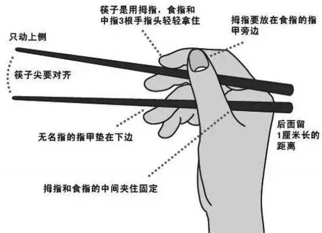

## 祖先为什么定十六两为一斤呢？

过去人们常用半斤八两来形容两个事物是一样的，为什么这么说呢？原来我们祖先使用的秤是十六两为一斤，所以半斤和八两就是一样的。那么老祖囘宗为什么定十六两为一斤呢？是他们不聪明吗？不是的。

传说我们的先人观察到北斗七星、南斗六星，再加上旁边的福、禄、寿三星，正好是十六星。北斗七星主亡、南斗六星主生，福、禄、寿三星分别主一个人一生的福、禄、寿。他们在天上看着人的一切。所以说：人在做，神在看。

据说做买卖的人，如果称东西，短斤少两，都要受到惩罚。卖东西少给人一两，福星就减少这个人的福；少给二两，禄星就给这个人减禄；要少给三两，寿星就给这个人减寿。

古代人都知道"人在做，神在看"，所以人都不敢做昧良心的事。

## 筷子为什么是7寸6分？

筷子的标准长度是七寸六分，代表人有七情六欲，以示与动物有本质的不同。有些人很羡慕西方人用刀叉吃饭，觉得这种姿势和仪态有品位。但学了之后也只是偶尔用用。在日常生活中餐餐都用刀叉的中国人，想必都是奇葩。

刀叉是冶金术成熟以后才有的用具。而冶金术是十五世纪才发明的，在广泛应用于日常生活中之前，西方人其实是用手吃饭。

相比之下，筷子的文明史显然长得多。

关键是，筷子是两根，称呼却是一双。在餐厅里呼唤服务生"拿一双筷子吧"，那肯定是中国人；如果说"拿两根筷子吧"，那一定是外国人。

为什么明明是两根筷子，却叫一双筷子呢？这里面有太极和阴阳的理念。太极是一，阴阳是二；一就是二，二就是一；一中含二，合二为一。这是中国人的哲学，西方人不懂。

筷子在使用的时候，讲究配合和协调。一根动，一根不动，才能夹得稳。两根都动，或者两根都不动，就夹不住。这是中国的阴阳原理，也有西方力学的杠杆原理。

筷子还有点穴、按摩和刮痧的作用。旧时人们走江湖，身上只要有一双筷子，有什么毛病都能自己搞掂。即便忘了带，随手掰根树枝或芦苇，折断了，在石头上磨一磨，在水里洗一洗，也能用。

中国文明和西方文明都从神话发源。西方后来人神分家了，做事靠科学，做人靠宗教。

中国没有。中国什么都合在一起：何仙姑、铁拐李、吕洞宾、孙悟空、猪八戒这些神仙也是人，他们就在茫茫人海中；中国人的理想和现实、灵魂与肉体也是合二为一的，每天用的筷子里面就有信仰，举手投足都是理念。这是一种通达和智慧。

所以，中国人不需要到专门的地方去清洗灵魂。从小就有长辈告诉他，如何做人做事，知道只有做好人才能做好事----这两者也不能分。

我们现在很多人，每天握着筷子指指点点，讥讽同胞没有信仰，其实是有所不知。

今天社会的症结不是没有信仰，而是丢掉了老祖宗的智慧。在中西方文明全面接触、交流和碰撞的过程中，有很多人云亦云的东西在干扰我们的价值判断，以致乱花渐欲迷人眼，五心不定，六神无主。

尼克松80年代出了一本书叫《1999，不战而胜》，很出名。他在书中的最后部分说了这么一句话："当有一天，中国的年轻人已经不再相信他们老祖宗的教导和他们的传统文化，我们美国人就不战而胜了。"

青松有挺拔美，鲜花有娇艳美。西方文明和中国文明是花开两朵各有特色。不能厚此薄彼，也不能顾此失彼。我们是中国人，表达信仰的方式和人家不同。我们生活在自己的信仰里。

一双筷子，不仅仅是饮食餐具，更承载了许多中国传统文化，凝结了许多前人智慧。作为中国人，这项传统不可废止，也将继续弘扬下去。
