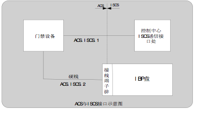
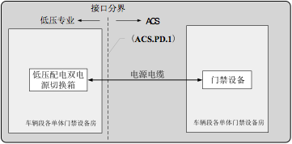
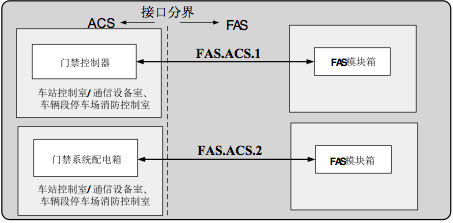
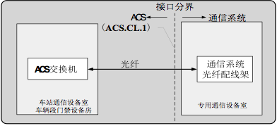

# 门禁系统与其他专业接口

## 概述

ACS在车站、车辆段与各专业存在各种各样的接口，为了保证各专业之间接口的协调和标准化，进行以下说明。门禁与其它系统的接口主要包括以下接口方式：

- 硬线接口
- 通信接口

## 与综合监控系统接口

### 接口界面

### 物理接口

| 编号         | 位置                          | ACS                                      | ISCS                                     | 接口类型/数量                                  |
| ---------- | --------------------------- | ---------------------------------------- | ---------------------------------------- | ---------------------------------------- |
| ACS.ISCS.1 | 控制中心航空港线系统设备机房综合监控系统配线端子外线侧 | 带编号的网络电缆与ISCS的端子排连接。                     | 为门禁系统提供RJ45形式10/100M以太网电口接口。  注：ISCS前置处理器机柜采用上进上出线方式。 | 2路，互为冗余10/100M以太网接口，IEEE  802.3标准，TCP/IP协议 |
| ACS.ISCS.2 | 车站控制室IBP盘端子排外线侧             | 提供ACS系统到IBP盘配线架带标识的连接电缆并负责成端上架。负责IBP盘上有关ACS系统的功能测试。  提供ACS系统的盘面布置要求、按钮/指示灯的数量、电气参数、二次接线原理图、文字描述。  提供IBP盘上所有与ACS有关的按钮/指示灯回路的电源。 | 提供IBP盘面工艺布置图、端子分配图、按钮/指示灯、接线端子排，并负责盘内接线。  注：IBP盘采用下进下出线方式。 | 硬线：数量按需要提供。  注：采用截面面积在1.0～2.5 mm2电缆。     |

### 接口功能

| 编号         | 功能要求                | ACS                                      | ISCS                                     | 备注                              |
| ---------- | ------------------- | ---------------------------------------- | ---------------------------------------- | ------------------------------- |
| ACS.ISCS.1 | 在ACS和ISCS之间提供通信通道   | 1.向ISCS提供：每个车站ACS系统总故障、系统状态等；  2.回应ISCS对ACS与ISCS之间的通道检测。 | 1.ISCS系统显示ACS系统总故障、系统状态信息等；  2.每隔一定时间，ISCS对ACS与之间的通道进行检测。 | ACS向ISCS系统上传信息为暂定，具体信息在设计联络时确定。 |
| ACS.ISCS.2 | 实现车站控制室对本站门禁的紧急释放功能 | 通过IBP盘上的紧急按钮，对门禁设备实现紧急手动控制，并点亮IBP盘上被控设备状态指示灯。 | 统一设计IBP盘，提供IBP的按钮和指示灯；                   | 硬线                              |

### 其它说明

由于综合监控系统在车辆段内不设置IBP盘，所以车辆段的门禁紧急释放按钮和指示灯由门禁系统自行在消防控制室设置，功能与车站门禁紧急释放按钮一致。

> # ACS-专题3
>
> 投标人在投标文件中应==以专题论述的形式详细阐述ACS设备与ISCS的接口方案==。包含但不限于：接口方式、接口位置、接口功能的实现方式等

## 与低压专业接口

### 接口界面

### 物理接口

| 编号       | 位置                                       | ACS                       | 低压专业（电源配电）                    | 接口类型 |
| -------- | ---------------------------------------- | ------------------------- | ----------------------------- | ---- |
| ACS.PD.1 | 在车辆段综合楼及信号楼消防控制室/车辆段门禁设备房内低压配电双电源切换箱馈线开关出线侧。 | 提供并敷设至低压双电源切换箱的电源电缆；负责调试。 | 提供低压双电源切换箱内的相关接线端子；配合ACS进行调试。 | 硬线接口 |

### 接口功能

| 编号       | ACS                                      | 低压专业（电源配电）                         |
| -------- | ---------------------------------------- | ---------------------------------- |
| ACS.PD.1 | 接收由低压双电源切换箱提供的可切换的双回路配电电源，电源为AC 220V，一级负荷；  区间变电所门禁设备配电的馈出回路不少于3个，变电所内门禁锁采用单独回路供电，其它设备（门禁控制器、就地控制器（接口模板）和读卡器等）采用一个回路供电，馈出回路的数量和容量应根据区间变电所门禁设备的回路数量最终确定；不带漏电保护装置。 | 向UPS提供可切换的双回路配电电源。电源为AC 220V，一级负荷。 |

### 车站级门禁系统配电方案

车站、车辆段内门禁设备的UPS电源由综合监控系统提供，后备时间为满足最大负荷情况下不少于1小时；供电负责提供UPS电源到门禁系统配电柜之间的电源线。

车站门禁设备配电的馈出回路不少于6个，分不同区域分别对门禁设备进行配电，车站门禁锁采用单独回路供电，馈出回路的数量和容量应根据车站门禁设备的回路数量最终确定，投标人应进行容量核算。

## 与接地专业的接口

ACS设计提出系统各用房的接地要求，由接地专业按照要求进行统一设计。

在车站综合监控设备室、通信设备室、车辆段消防控制室、车辆段门禁设备房（通信设备机房）的接地专业提供的接地母排的端子处。车站、车辆段的提供的接地电阻为不大于1Ω。门禁系统负责提供门禁设备到接地母排之间的接地线。

> # ACS-专题4
>
> 投标人应==以专题的形式提出车站级门禁系统（包括车站和车辆段、区间风井）设备的具体配电方案和接地方案==。

## 与火灾自动报警系统接口

### 接口界面

### 物理接口

| 编号        | 位置                          | ACS        | FAS                                 | 接口类型 |
| --------- | --------------------------- | ---------- | ----------------------------------- | ---- |
| ACS.FAS.1 | 车控室、车辆段消防控制室门禁控器接线端子上。      | 配合FAS进行调试。 | 提供并敷设FAS 模块箱至车站门禁控制器接线端子的控制电缆；负责调试。 | 硬线接口 |
| ACS.FAS.2 | 车控室、车辆段消防控制室门禁配电柜进线开关分离脱扣处。 | 配合FAS进行调试。 | 提供并敷设FAS 模块箱至车站门禁配电柜接线端子的控制电缆；负责调试。 | 硬线接口 |

### 接口功能

| 编号        | ACS                                      | FAS                    |
| --------- | ---------------------------------------- | ---------------------- |
| ACS.FAS.1 | 火灾情况下，门禁控制器接受FAS发出的确认后的火灾信息，通过系统软件释放门禁电锁。 | 火灾情况下，向门禁系统发出确认后的火灾信息。 |
| ACS.FAS.2 | 火灾情况下， 门禁系统接受切除非消防电源，系统断电解锁。             | 火灾情况下，切除门禁非消防电源。       |

## 与通信传输系统的接口

### 接口位置

### 物理接口

| 编号       | 位置                         | ACS                                  | 通信传输系统                                   | 接口类型 |
| -------- | -------------------------- | ------------------------------------ | ---------------------------------------- | ---- |
| ACS.CL.1 | 在各车站、车辆段的专用通信设备室内光纤配线架外线侧。 | 提供并敷设ACS交换机至通信设备室通信配线架外线侧的通信线缆；负责调试。 | 负责通信传输设备为ACS提供通信接口的接线端子，并负责将从ACS交换机敷设来的通信线缆连接到接线端子上，配合ACS进行调试。 | 通信接口 |

### 功能接口

| 编号       | ACS                | 通信传输系统                                   |
| -------- | ------------------ | ---------------------------------------- |
| ACS.CL.1 | 利用通信通道构建ACS全线传输网络。 | 向ACS提供符合IEEE802.3标准的10/100M以太网接口。为全线ACS信息交换网络提供专用光纤通道。 |

## 与通信时钟系统的接口

### 接口界面

### 物理接口

| 编号        | 位置                        | ACS                                      | 时钟系统                                     | 接口类型 |
| --------- | ------------------------- | ---------------------------------------- | ---------------------------------------- | ---- |
| ACS.CLK.1 | 在车辆段专用通信设备室时钟系统通信接口处。     | 提供并敷ACS服务器至时钟系统通信综合配线架端子（外线侧）时钟接口的通信电缆；负责调试。 | 负责通信时钟设备为ACS提供通信接口的接线端子，并负责将从ACS服务器敷设来的通信线缆连接到接线端子上；配合ACS进行调试。 | 通信接口 |
| ACS.CLK.2 | 在控制中心航空港8线通信设备室时钟系统通信接口处。 | 提供并敷ACS服务器至时钟系统通信综合配线架端子（外线侧）时钟接口的通信电缆；负责调试。 | 负责通信时钟设备为ACS提供通信接口的接线端子，并负责将从ACS服务器敷设来的通信线缆连接到接线端子上；配合ACS进行调试。 | 通信接口 |

### 接口功能

| 编号                   | ACS                      | 时钟系统            |
| -------------------- | ------------------------ | --------------- |
| ACS.CLK.1  ACS.CLK.2 | 接收时间信号，并根据时间信号校准ACS系统时钟。 | 为ACS系统提供标准时间信息。 |

## 与建筑装修专业接口

### 接口界面

门禁专业与建筑专业的分界点在安装门禁设备的管理及设备用房、通道门等处。

### 接口说明

ACS向建筑专业提供设备管理用房房门安装门禁电子锁的要求，提供门禁设备用房的规模及要求（含工艺及装修，以及孔洞预留等）。

建筑装修专业负责公共区门禁设备安装后的装修设计。

建筑专业根据门禁电子锁安装要求考虑对门锁的加固措施。

## 与安全门专业接口

### 接口界面

门禁专业与安全门专业的分界点在车站站台安全门端门处。ACS专业负责提供门禁电子锁，PSD专业负责提供其安装条件。

### 接口的说明

- ACS向安全门专业提供安全门安装门禁电子锁的要求（含工艺要求、以及孔洞预留等）。
- 安全门专业根据门禁电子锁安装要求考虑门锁的加固措施以及安装所需的端门自身结构调整。
- 具体内容在设计联络时确定。

---

